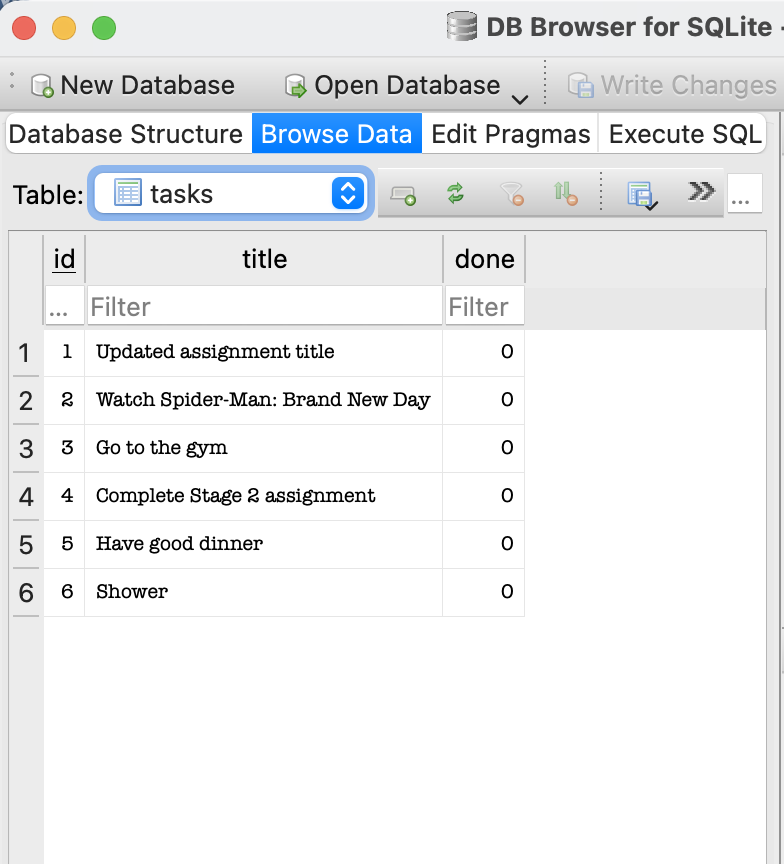

# Task Management CRUD API (SQLite Edition)

A RESTful CRUD API for managing tasks, built using **Node.js**, **Express**, and **SQLite** (`better-sqlite3`). This project replaces temporary in-memory storage with persistent SQLite database storage, ensuring that data survives application restarts.

---

## Why SQLite?

* **Zero Configuration:** SQLite is a self-contained, serverless database engine that requires no separate server setup or background services.
* **Data Persistence:** The database is saved in a local file (`tasks.db`), guaranteeing that data persists when the server restarts.
* **Fast & Lightweight:** Interacts directly with the application through high-performance synchronous calls via `better-sqlite3`.

---

## Database Details

* **Database File:** `./tasks.db` (created automatically in the project root on first startup)
* **Schema:**
  ```sql
  CREATE TABLE IF NOT EXISTS tasks (
      id INTEGER PRIMARY KEY AUTOINCREMENT,
      title TEXT NOT NULL,
      done INTEGER NOT NULL DEFAULT 0
  );

## API Endpoints

| Method | Endpoint | Description | Request Body | Expected Status |
| :--- | :--- | :--- | :--- | :--- |
| **GET** | `/` | API metadata & version info | *None* | `200 OK` |
| **GET** | `/health` | Server health check | *None* | `200 OK` |
| **GET** | `/tasks` | Retrieve all tasks from database | *None* | `200 OK` |
| **GET** | `/tasks/:id` | Retrieve a single task by ID | *None* | `200 OK` / `404 Not Found` |
| **POST** | `/tasks` | Insert a new task | `{"title": "string", "done": boolean}` | `201 Created` / `400 Bad Request` |
| **PUT** | `/tasks/:id` | Update an existing task | `{"title": "string", "done": boolean}` | `200 OK` / `400 Bad Request` / `404 Not Found` |
| **DELETE** | `/tasks/:id` | Remove a task from database | *None* | `204 No Content` / `404 Not Found` |

How to Install & RunClone the repository:
Bash: 
git clone [https://github.com/Evie-SE/CRUD_App.git](https://github.com/Evie-SE/CRUD_App.git)
cd CRUD_App

Install dependencies:
Bash npm install
Start the server:
Bash node app.js

Note: On the initial run, tasks.db and the tasks table will be auto-generated and populated with initial seed tasks.

 Database Viewer ScreenshotBelow is a view of the database contents using DB Browser for SQLite:

 
 
 Example SQL Query ExecutedDuring manual testing with DB Browser for SQLite, the following query was executed to filter for completed tasks:
 SQLSELECT * FROM tasks WHERE done = 1;

Sample curl Testing

1. Retrieve all tasks (GET /tasks)Bashcurl -i http://localhost:3000/tasks
Response:HTTPHTTP/1.1 200 OK
Content-Type: application/json; charset=utf-8

[
  { "id": 1, "title": "Accomplish Week 3 Backend Task", "done": false },
  { "id": 2, "title": "Watch Spider-Man: Brand New Day", "done": false },
  { "id": 3, "title": "Go to the gym", "done": false }
]

2. Create a task (POST /tasks)Bashcurl -i -X POST http://localhost:3000/tasks \
  -H "Content-Type: application/json" \
  -d '{"title":"Finish stage 2","done":true}'
Response:HTTPHTTP/1.1 201 Created
Content-Type: application/json; charset=utf-8

{"id":4,"title":"Finish stage 2","done":true}

3. Update a task (PUT /tasks/1)Bashcurl -i -X PUT http://localhost:3000/tasks/1 \
  -H "Content-Type: application/json" \
  -d '{"done":true}'
Response:HTTPHTTP/1.1 200 OK
Content-Type: application/json; charset=utf-8

{"id":1,"title":"Accomplish Week 3 Backend Task","done":true}

4. Delete a task (DELETE /tasks/1)Bashcurl -i -X DELETE http://localhost:3000/tasks/1
Response:HTTPHTTP/1.1 204 No Content