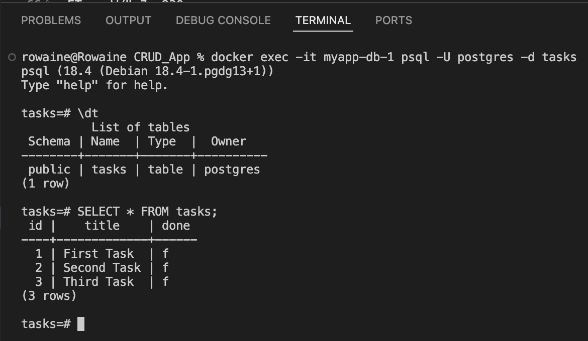

# Containerized Task Management API

A RESTful Task Management CRUD API built with Node.js, Express, and PostgreSQL, fully containerized using Docker and Docker Compose. 

This project runs both the API service and the PostgreSQL database in isolated Docker containers, allowing the complete stack to launch with a single command without manual database setup.

---

##  Quick Start (One-Command Launch)

### Prerequisites
* [Docker Desktop](https://www.docker.com/products/docker-desktop/) installed and running.

### Running the Application
1. **Clone the repository:**
   ```bash
   git clone <YOUR_GITHUB_REPO_URL>
   cd <REPO_FOLDER>/myapp

2. **Set up environment variables:**
Copy the .env.example file to create your local .env file:
Bash
cp .env.example .env

3. **Start the stack:**
Bash
docker compose up --build
The API will be accessible at http://localhost:3000.

4. **Stop the stack:**
Bash
docker compose down
(Data will persist across restarts via the Docker volume taskdata).

##  Environment Variables

The application relies on the following environment variable defined in `.env` (refer to `.env.example` for reference):

| Variable | Description | Example / Default Value |
| :--- | :--- | :--- |
| `DATABASE_URL` | PostgreSQL connection string used by the API service | `postgres://postgres:dev@db:5432/tasks` |

> **Note:** Inside the Docker Compose network, the database service is reachable via host `db`.

##  API Endpoints

| Method | Endpoint | Description | Status Codes |
| :--- | :--- | :--- | :--- |
| `GET` | `/tasks` | Retrieve all tasks from the database | `200 OK` |
| `GET` | `/tasks/:id` | Retrieve a single task by its ID | `200 OK`, `404 Not Found` |
| `POST` | `/tasks` | Create a new task (requires JSON body with `title`) | `201 Created`, `400 Bad Request` |
| `PUT` | `/tasks/:id` | Update a task's `title` and `done` status | `200 OK`, `400 Bad Request`, `404 Not Found` |
| `DELETE` | `/tasks/:id` | Delete a task by ID | `204 No Content`, `404 Not Found` |

Sample Request & Response (curl -i)
Get All Tasks (GET /tasks)
Bash
curl -i http://localhost:3000/tasks
Output:

HTTP
HTTP/1.1 200 OK
X-Powered-By: Express
Content-Type: application/json; charset=utf-8
Content-Length: 167
ETag: W/"a7-x930...
Date: Sun, 09 Aug 2026 08:50:00 GMT
Connection: keep-alive
Keep-Alive: timeout=5

[
  {"id":1,"title":"Set up Postgres in Docker","done":true},
  {"id":2,"title":"Connect API using .env","done":true},
  {"id":3,"title":"Containerize stack with Compose","done":true}
]
Database Verification
Below is a screenshot confirming the database tables and seeded records running inside the PostgreSQL Docker container (docker exec -it <db_container> psql -U postgres -d tasks):
;