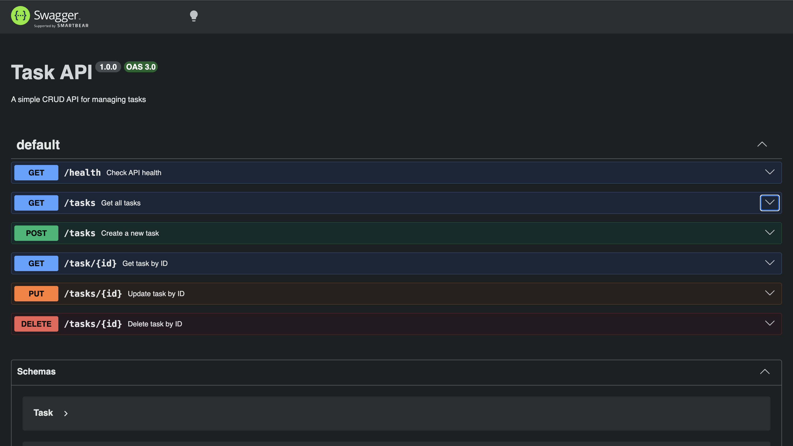

# Task Management CRUD API

A simple, in-memory RESTful CRUD API for managing tasks, built using Node.js and Express. This project covers full CRUD (Create, Read, Update, Delete) operations, input validation, proper HTTP response status codes, and interactive API documentation with Swagger UI.

---

##  Features & Endpoints

| Method | Endpoint | Description | Expected Status |
| :--- | :--- | :--- | :--- |
| **GET** | `/` | API info & version | `200 OK` |
| **GET** | `/health` | Server health check | `200 OK` |
| **GET** | `/tasks` | Retrieve all tasks | `200 OK` |
| **GET** | `/tasks/:id` | Retrieve a single task by ID | `200 OK` / `404 Not Found` |
| **POST** | `/tasks` | Create a new task | `201 Created` / `400 Bad Request` |
| **PUT** | `/tasks/:id` | Update an existing task | `200 OK` / `400 Bad Request` / `404 Not Found` |
| **DELETE** | `/tasks/:id` | Delete a task by ID | `204 No Content` / `404 Not Found` |

---

##  How to Install & Run

1. **Clone the repository:**
   ```bash
   git clone [https://github.com/Evie-SE/CRUD_App.git](https://github.com/Evie-SE/CRUD_App.git)
   cd CRUD_App

Install dependencies:

Bash
npm install
Start the server:

Bash
node app.js
The server will run at http://localhost:3000.

 API Documentation (Swagger UI)
Interactive documentation is available via Swagger UI. Once the server is running, visit:
http://localhost:3000/docs

Sample curl Output
1. Retrieve all tasks (GET /tasks)
Bash
curl -i http://localhost:3000/tasks
Response:

HTTP
HTTP/1.1 200 OK
X-Powered-By: Express
Content-Type: application/json; charset=utf-8
Content-Length: 212
Date: Sat, 01 Aug 2026 04:00:00 GMT
Connection: keep-alive

[
  { "id": 1, "title": "Accomplish Week 2 Backend Task", "done": false },
  { "id": 2, "title": "Get a good night's sleep", "done": false },
  { "id": 3, "title": "Accomplish ML Assignment", "done": false }
]
2. Create a task (POST /tasks)
Bash
curl -i -X POST http://localhost:3000/tasks \
  -H "Content-Type: application/json" \
  -d '{"title":"Buy milk"}'
Response:

HTTP
HTTP/1.1 201 Created
X-Powered-By: Express
Content-Type: application/json; charset=utf-8
Content-Length: 38
Date: Sat, 01 Aug 2026 04:02:00 GMT
Connection: keep-alive

{"id":4,"title":"Buy milk","done":false}
3. Delete a task (DELETE /tasks/1)
Bash
curl -i -X DELETE http://localhost:3000/tasks/1
Response:

HTTP
HTTP/1.1 204 No Content
X-Powered-By: Express
Date: Sat, 01 Aug 2026 04:04:49 GMT
Connection: keep-alive

